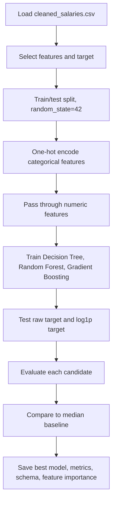
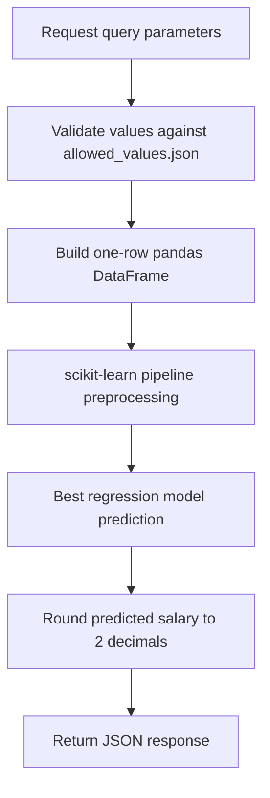

# AI Workflow

## Overview

The AI behavior has two separate parts:

1. A supervised machine learning salary prediction model.
2. An optional local LLM narrative generator that explains predictions using only the model output and dataset-derived benchmarks.

The project does not implement RAG, embeddings, vector search, agents, tool-calling, or a hosted LLM API.

## Dataset

| File                                  | Rows | Purpose                                                   |
| ------------------------------------- | ---: | --------------------------------------------------------- |
| `backend/data/raw/ds_salaries.csv`            |  607 | Original salary dataset.                                  |
| `backend/data/processed/cleaned_salaries.csv` |  558 | Cleaned dataset used by training and API benchmark logic. |

Raw columns include compact category codes such as `MI`, `SE`, `FT`, and `M`. The cleaning notebook expands these into readable labels.

## Cleaning Workflow

Implemented in `notebooks/01_data_cleaning.ipynb`.

Main steps:

1. Load `backend/data/raw/ds_salaries.csv`.
2. Standardize column names.
3. Remove missing values.
4. Remove duplicate rows.
5. Trim text columns.
6. Expand encoded labels:
   - Experience: `EN`, `MI`, `SE`, `EX` to readable levels.
   - Employment: `FT`, `PT`, `CT`, `FL` to readable types.
   - Company size: `S`, `M`, `L` to readable sizes.
7. Coerce numeric fields.
8. Remove invalid non-positive salary rows.
9. Remove extreme `salary_in_usd` outliers above the 99th percentile.
10. Group rare `job_title` values into `Other`.
11. Add readable `work_setting` from `remote_ratio`.
12. Save `backend/data/processed/cleaned_salaries.csv`.

## Model Training Workflow

Implemented in `notebooks/02_model_training.ipynb`.



## Model Type

The saved model is the best selected scikit-learn regression pipeline:

```text
Pipeline
+-- preprocessor: ColumnTransformer
|   +-- categorical: OneHotEncoder(handle_unknown="ignore")
|   +-- numeric: passthrough
+-- model: RandomForestRegressor(random_state=42)
```

The training notebook compares these candidates:

- `DecisionTreeRegressor`
- `RandomForestRegressor`
- `GradientBoostingRegressor`

Each candidate is tested with the raw salary target and with a `log1p` target transformation. The current selected model is `RandomForestRegressor | raw target`.

## Features and Target

| Field                | Type        | Role    |
| -------------------- | ----------- | ------- |
| `work_year`          | Numeric     | Feature |
| `experience_level`   | Categorical | Feature |
| `employment_type`    | Categorical | Feature |
| `job_title`          | Categorical | Feature |
| `employee_residence` | Categorical | Feature |
| `remote_ratio`       | Numeric     | Feature |
| `company_location`   | Categorical | Feature |
| `company_size`       | Categorical | Feature |
| `salary_in_usd`      | Numeric     | Target  |

`work_setting` is kept in the cleaned dataset for readability but excluded from training because it duplicates information already present in `remote_ratio`.

## Model Comparison

The training notebook compares all candidates on the same held-out test split and chooses the best model mainly by MAE, with R2 used as a secondary check. The test set is not used during fitting.

## Evaluation Metrics

From `backend/models/model_metrics.json`:

| Metric | Best Model | Median Baseline |
| ------ | ----------: | --------------: |
| MAE    |   24,817.84 |       49,323.92 |
| RMSE   |   33,966.23 |       59,810.14 |
| R2     |      0.6729 |         -0.0143 |

The selected model clearly outperforms the simple median-salary baseline. Its R2 is stronger than the earlier Decision Tree-only result, but the prediction is still decision support rather than a final compensation authority.

## Feature Importance

Feature importance is saved in `backend/data/processed/feature_importance.csv`. The highest-impact feature in the current artifact is `employee_residence_US`, followed by experience-level and work-year related features.

Because this is a one-hot encoded decision tree, importances are assigned to encoded feature columns rather than only to original business fields.

## Inference Flow



## Dataset Insights

The `/analyze` endpoint calculates benchmark averages from `backend/data/processed/cleaned_salaries.csv`:

- Overall average salary.
- Average salary for the selected experience level.
- Average salary for the selected company size.
- Average salary for the selected job title.

If a filtered group has no rows, the API falls back to the overall average.

## Chart Generation

`backend/api/charts.py` groups the cleaned dataset by `experience_level`, calculates average salary, and creates a bar chart. It overlays the predicted salary as a horizontal dashed line and saves a PNG under:

```text
backend/static/charts/
```

The API returns a relative chart URL such as:

```text
/static/charts/salary_comparison_<uuid>.png
```

## LLM Analysis

Implemented in `backend/api/llm_analysis.py`.

The app sends a prompt to:

```text
http://localhost:11434/api/generate
```

Payload:

```json
{
  "model": "llama3.2",
  "prompt": "Generated prompt with input fields, predicted salary, and dataset insights.",
  "stream": false
}
```

The prompt asks for three short sections:

1. Salary Prediction Summary
2. Market Comparison
3. Key Factors

The prompt also instructs the model to avoid inventing facts outside the provided data.

## Failure Behavior

If Ollama is unavailable, times out, or returns an error, `/analyze` still returns the salary prediction. The `llm_analysis` field contains a human-readable error message instead of generated analysis.

## Model Limitations

- The dataset is small: 558 cleaned rows.
- Valid API inputs are limited to categories observed in the cleaned dataset.
- The selected model is still trained on a small historical dataset and may generalize poorly outside training-like records.
- Salaries are historical and may not represent current market rates.
- The model predicts point estimates only; it does not provide confidence intervals.
- Location and role categories may be sparse.

## Assumptions / Missing Information

- The notebooks do not document the original public source or license of `ds_salaries.csv`.
- No model card, fairness evaluation, subgroup error analysis, or drift monitoring report is included.
- No retraining automation or scheduled data refresh exists.


