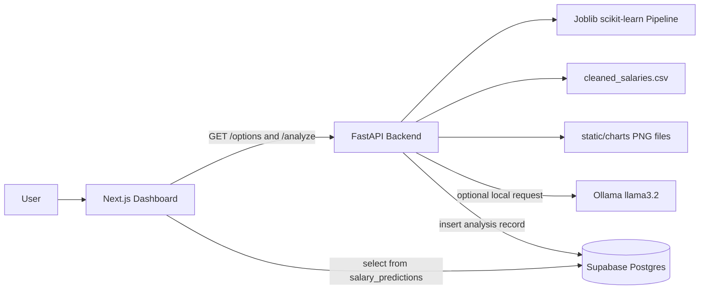
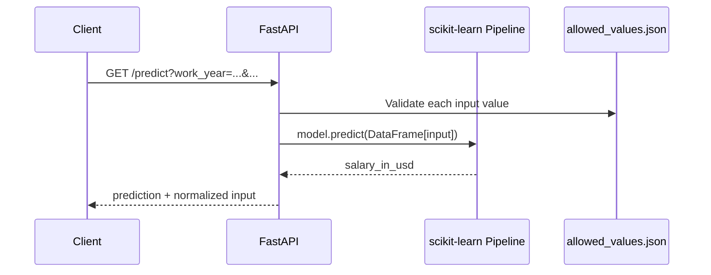
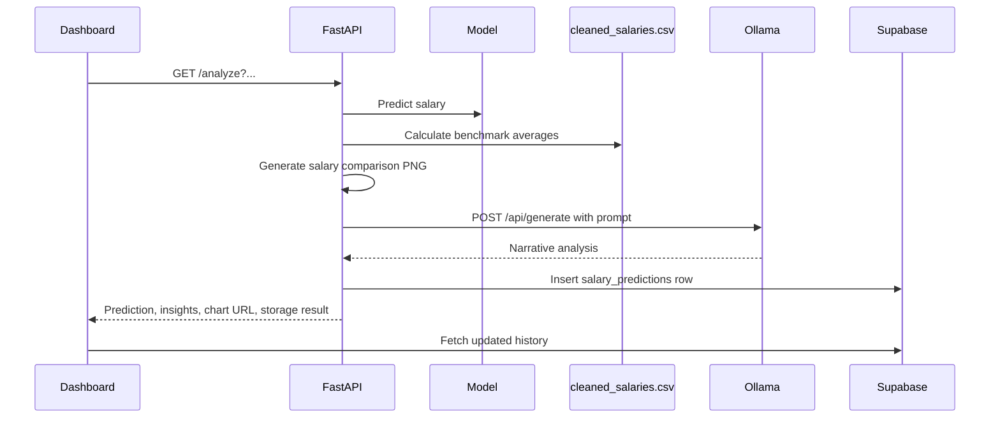
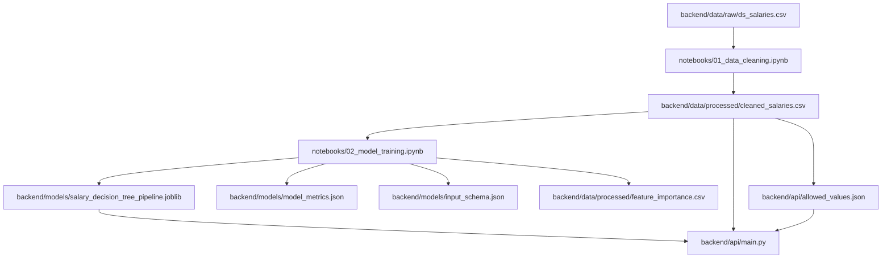

# System Architecture

## Overview

The Salary Prediction App is a full-stack ML application with four main runtime parts:

1. A FastAPI backend that loads model and data artifacts.
2. A scikit-learn prediction pipeline saved as a Joblib file.
3. Supabase for storing and reading saved salary analyses.
4. A Next.js dashboard for simulation, filtering, charting, and comparison.

Ollama is an optional local dependency used only by `/analyze` to create a narrative explanation. The salary prediction itself does not depend on Ollama.

## High-Level Architecture

## Runtime Components

| Component                | Location                           | Responsibility                                                                                          |
| ------------------------ | ---------------------------------- | ------------------------------------------------------------------------------------------------------- |
| FastAPI app              | `backend/api/main.py`                      | Defines routes, loads model/data, validates inputs, runs predictions, creates analysis responses.       |
| Validation helper        | `backend/api/validation.py`                | Rejects query parameter values not present in `backend/api/allowed_values.json`.                                |
| Chart generator          | `backend/api/charts.py`                    | Builds matplotlib salary comparison PNGs in `backend/static/charts/`.                                           |
| LLM analysis             | `backend/api/llm_analysis.py`              | Sends prompt context to local Ollama `llama3.2` and returns narrative text or a graceful error message. |
| Supabase service         | `backend/api/supabase_service.py`          | Creates Supabase client, inserts analysis rows, and fetches recent history.                             |
| Next.js dashboard        | `frontend/src/app/page.tsx`       | Renders dashboard UI, filters history, runs simulations, displays chart and analysis details.           |
| Frontend data client     | `frontend/src/lib/predictions.ts` | Calls FastAPI for options/analysis and Supabase for history.                                            |
| Frontend Supabase client | `frontend/src/lib/supabase.ts`    | Initializes browser Supabase client from public environment variables.                                  |

## Request Flow

### Prediction-Only Flow

### Analysis and Save Flow

## Data and Artifact Flow

## Folder and File Responsibilities

| Path                                          | Purpose                                                                |
| --------------------------------------------- | ---------------------------------------------------------------------- |
| `backend/api/main.py`                                 | API application entrypoint and route definitions.                      |
| `backend/api/allowed_values.json`                     | Valid values for request validation, derived from the cleaned dataset. |
| `backend/api/create_allowed_values.py`                | Regenerates `allowed_values.json` from `cleaned_salaries.csv`.         |
| `backend/api/validation.py`                           | Shared input validation helper.                                        |
| `backend/api/charts.py`                               | Creates salary comparison charts.                                      |
| `backend/api/llm_analysis.py`                         | Local Ollama prompt and response handling.                             |
| `backend/api/supabase_service.py`                     | Supabase connection, insert, and history query logic.                  |
| `frontend/src/app/page.tsx`                  | Main interactive dashboard screen.                                     |
| `frontend/src/lib/predictions.ts`            | Frontend API and Supabase data functions.                              |
| `frontend/src/lib/supabase.ts`               | Supabase browser client configuration.                                 |
| `frontend/src/types/prediction.ts`           | TypeScript shape of saved prediction rows.                             |
| `backend/data/raw/ds_salaries.csv`                    | Original salary dataset.                                               |
| `backend/data/processed/cleaned_salaries.csv`         | Cleaned model-ready dataset.                                           |
| `backend/data/processed/feature_importance.csv`       | Feature importance report from trained decision tree.                  |
| `backend/models/salary_decision_tree_pipeline.joblib` | Saved preprocessing and regression pipeline.                           |
| `backend/models/model_metrics.json`                   | Model metrics and selected hyperparameters.                            |
| `backend/models/input_schema.json`                    | Expected model input schema.                                           |
| `notebooks/01_data_cleaning.ipynb`            | Raw-to-cleaned data preparation notebook.                              |
| `notebooks/02_model_training.ipynb`           | Training, tuning, evaluation, and artifact export notebook.            |
| `scripts/test_prediction_api.py`              | API validation and prediction test script.                             |
| `backend/static/charts/`                              | Generated PNG chart files returned by `/analyze`.                      |

## Architecture Decisions

- The model artifact includes preprocessing and regression in one pipeline, reducing training/inference drift.
- API validation uses observed dataset values so predictions stay inside the known training domain.
- The LLM is local through Ollama, so no hosted LLM API key is required.
- Supabase is optional for `/analyze` storage, but required for `/history` and for the dashboard history view.

## Assumptions / Missing Information

- No load balancer, container, reverse proxy, CI/CD, or production hosting configuration exists in the repository.
- No database migrations exist; database structure is inferred from application code.
- The API and dashboard are separate deployable services.
- The dashboard reads history directly from Supabase instead of calling the backend `/history` endpoint.

