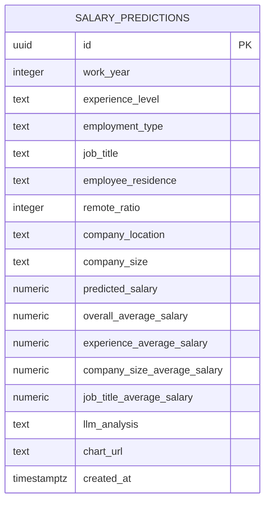

# Database Documentation

## Overview

The project uses Supabase Postgres to store saved salary analysis records. Database access appears in two places:

- Backend insert and history query: `api/supabase_service.py`
- Frontend direct history query: `dashboard/src/lib/predictions.ts`

The repository does not include database migrations or SQL schema files. The schema below is inferred from application code.

## Database Provider

| Item              | Value                   |
| ----------------- | ----------------------- |
| Provider          | Supabase                |
| Table used by app | `salary_predictions`    |
| Backend library   | `supabase-py`           |
| Frontend library  | `@supabase/supabase-js` |

## Inferred Table: `salary_predictions`

| Column                        | Inferred Type  | Nullable | Source                                 |
| ----------------------------- | -------------- | -------- | -------------------------------------- |
| `id`                          | `uuid` or text | No       | Frontend type expects string ID.       |
| `work_year`                   | integer        | Yes      | Backend insert and frontend type.      |
| `experience_level`            | text           | Yes      | Backend insert and frontend type.      |
| `employment_type`             | text           | Yes      | Backend insert and frontend type.      |
| `job_title`                   | text           | Yes      | Backend insert and frontend type.      |
| `employee_residence`          | text           | Yes      | Backend insert and frontend type.      |
| `remote_ratio`                | integer        | Yes      | Backend insert and frontend type.      |
| `company_location`            | text           | Yes      | Backend insert and frontend type.      |
| `company_size`                | text           | Yes      | Backend insert and frontend type.      |
| `predicted_salary`            | numeric        | Yes      | Backend insert and frontend type.      |
| `overall_average_salary`      | numeric        | Yes      | Backend insert and frontend type.      |
| `experience_average_salary`   | numeric        | Yes      | Backend insert and frontend type.      |
| `company_size_average_salary` | numeric        | Yes      | Backend insert and frontend type.      |
| `job_title_average_salary`    | numeric        | Yes      | Backend insert and frontend type.      |
| `llm_analysis`                | text           | Yes      | Backend insert and frontend type.      |
| `chart_url`                   | text           | Yes      | Backend insert and frontend type.      |
| `created_at`                  | timestamptz    | Yes      | Frontend display and backend ordering. |

## Suggested SQL Schema

Use this as a starting point if the table must be recreated. It is not currently present as a migration in the repository.

```sql
create table if not exists public.salary_predictions (
    id uuid primary key default gen_random_uuid(),
    work_year integer,
    experience_level text,
    employment_type text,
    job_title text,
    employee_residence text,
    remote_ratio integer,
    company_location text,
    company_size text,
    predicted_salary numeric,
    overall_average_salary numeric,
    experience_average_salary numeric,
    company_size_average_salary numeric,
    job_title_average_salary numeric,
    llm_analysis text,
    chart_url text,
    created_at timestamptz not null default now()
);
```

## Application Queries

### Insert Analysis Result

Implemented in `api/supabase_service.py`.

```python
supabase.table("salary_predictions").insert(row).execute()
```

The inserted row includes:

- Request input fields.
- Predicted salary.
- Dataset benchmark averages.
- LLM analysis text.
- Static chart URL.

### Fetch Recent History

Implemented in `api/supabase_service.py`.

```python
(
    supabase.table("salary_predictions")
    .select("*")
    .order("created_at", desc=True)
    .limit(limit)
    .execute()
)
```

### Frontend History Query

Implemented in `dashboard/src/lib/predictions.ts`.

```typescript
supabase
  .from("salary_predictions")
  .select("*")
  .order("created_at", { ascending: false });
```

## Relationships

There are no table relationships in the current application. `salary_predictions` is a standalone event/history table.



## Access Pattern

| Actor     | Access                                                                      |
| --------- | --------------------------------------------------------------------------- |
| Backend   | Uses `SUPABASE_SERVICE_ROLE_KEY` to insert rows and read history.           |
| Dashboard | Uses `NEXT_PUBLIC_SUPABASE_ANON_KEY` to read `salary_predictions` directly. |

## Row-Level Security Considerations

Because the dashboard reads directly from Supabase with the anon key, Supabase Row-Level Security policies must allow the intended read behavior.

Recommended starting posture:

- Enable RLS on `salary_predictions`.
- Allow public read only if prediction history is intentionally public.
- Prefer authenticated read policies if prediction records may include sensitive user inputs.
- Do not allow anon inserts if backend insertion is the intended write path.

## Performance Considerations

- Add an index on `created_at desc` if the table grows:

```sql
create index if not exists salary_predictions_created_at_idx
on public.salary_predictions (created_at desc);
```

- Add indexes on filter-heavy fields if dashboard filtering is moved from client-side to server-side.
- Avoid selecting all rows from the frontend for large history tables. Add pagination or date filters.

## Assumptions / Missing Information

- No official SQL migration exists in the repo.
- Existing Supabase RLS policies are not visible in source code.
- The exact database column types are inferred, not verified from a live Supabase schema.
