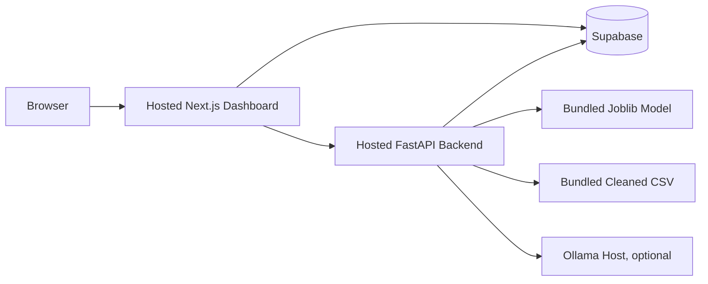

# Deployment Guide

## Overview

The repository does not include production deployment files. This guide describes practical deployment approaches based on the current codebase.

The app has two deployable services:

1. FastAPI backend.
2. Next.js dashboard.

Supabase is an external managed database dependency. Ollama is optional but must be available to the backend if production LLM analysis is required.

## Deployment Architecture



## Backend Deployment Requirements

The backend deployment must include:

- `backend/api/`
- `backend/models/salary_decision_tree_pipeline.joblib`
- `backend/data/processed/cleaned_salaries.csv`
- `backend/api/allowed_values.json`
- `backend/requirements.txt`
- Writable storage for `backend/static/charts/`, or an alternative object-storage implementation.

Install command:

```bash
pip install -r backend/requirements.txt
```

Start command:

```bash
uvicorn backend.api.main:app --host 0.0.0.0 --port $PORT
```

If the platform does not provide `PORT`, use:

```bash
uvicorn backend.api.main:app --host 0.0.0.0 --port 8000
```

## Backend Environment Variables

```env
SUPABASE_URL=your_supabase_project_url
SUPABASE_SERVICE_ROLE_KEY=your_supabase_service_role_key
```

## Dashboard Deployment Requirements

Deploy the `frontend/` directory as a Next.js app.

Build command:

```bash
npm install
npm run build
```

Start command:

```bash
npm run start
```

## Dashboard Environment Variables

```env
NEXT_PUBLIC_SUPABASE_URL=your_supabase_project_url
NEXT_PUBLIC_SUPABASE_ANON_KEY=your_supabase_anon_key
NEXT_PUBLIC_API_BASE_URL=https://your-api-domain.example.com
```

## Supabase Setup

Create the `salary_predictions` table. See [Database](database.md) for the inferred schema.

Minimum expected capabilities:

- Backend service role key can insert rows.
- Backend service role key can select history.
- Frontend anon key can select history if public dashboard history is intended.

## Static Chart Storage

The backend currently writes PNG files to local disk under:

```text
backend/static/charts/
```

This works in local development. In production, verify whether the hosting platform provides persistent writable disk.

Recommended production alternatives:

- Store generated charts in Supabase Storage, S3, or another object store.
- Return chart data to the frontend and render charts client-side.
- Periodically clean old local chart files if disk is persistent but limited.

## Ollama Deployment Options

The current code expects:

```text
http://localhost:11434/api/generate
```

This means Ollama must run on the same host/container network as the API or the code must be updated to read `OLLAMA_URL` and `OLLAMA_MODEL` from environment variables.

Production options:

- Run Ollama on the same VM as FastAPI.
- Run Ollama as a sidecar service in the same private network.
- Disable LLM analysis and rely on model prediction plus dataset insights.
- Refactor to a hosted LLM provider if that is acceptable for the data privacy model.

## Production Hardening Checklist

- Restrict CORS to the deployed dashboard domain.
- Add API authentication if predictions should not be public.
- Move Ollama URL/model to environment variables.
- Add a database migration for `salary_predictions`.
- Confirm Supabase RLS policies match intended access.
- Add rate limiting for `/predict` and `/analyze`.
- Replace local chart storage with durable object storage.
- Add structured logging and request tracing.
- Add health checks for model artifact, dataset, Supabase, and Ollama.

## Example Deployment Split

| Component | Suitable Platform                                       |
| --------- | ------------------------------------------------------- |
| Dashboard | Vercel, Netlify, Node server                            |
| FastAPI   | Render, Railway, Fly.io, Azure App Service, AWS ECS, VM |
| Supabase  | Supabase hosted project                                 |
| Ollama    | VM or GPU/CPU host reachable by backend                 |

## Smoke Test After Deployment

1. Open the API health endpoint:

```text
https://your-api-domain.example.com/health
```

2. Confirm:

```json
{
  "status": "ok",
  "model_loaded": true,
  "dataset_loaded": true
}
```

3. Call `/options`.
4. Call `/predict` with known valid values.
5. Call `/analyze`.
6. Confirm Supabase row insertion.
7. Open the dashboard and confirm history loads.

## Assumptions / Missing Information

- No deployment platform is specified.
- No Dockerfile, container configuration, Procfile, CI workflow, or platform-specific config file exists.
- The current local chart storage design may not work on stateless hosting.


